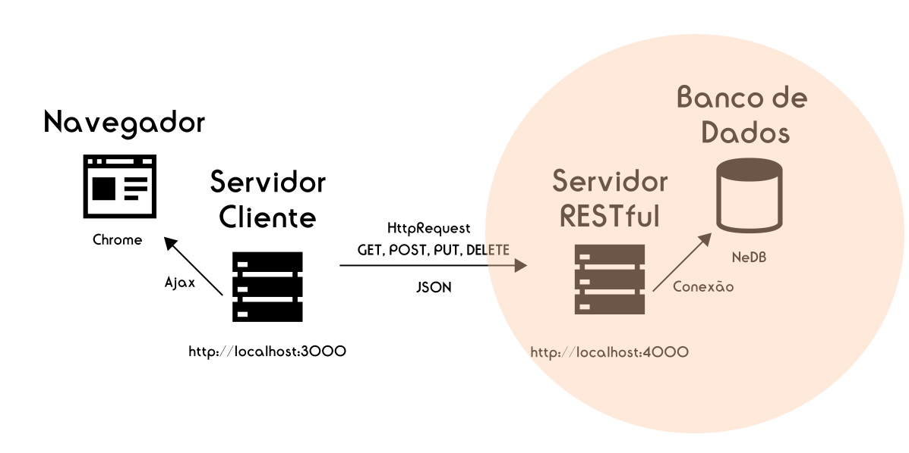

# BACKEND-NodeJsServer
Microserviço responsável por processar requisições web e aplicar regras de negócio em conjunto com o banco de dados.

Este projeto tem como objetivo processar as requisições enviadas pelo web-service https://github.com/andreiRibeiro/BACKEND-NodeJsClient

Neste projeto utilizo express para disponibilizar o serviço na web (localmente) e o NeDb como banco de dados NoSql para efetuar as operações de crud.

#### 1) Arquitetura de funcionamento.

